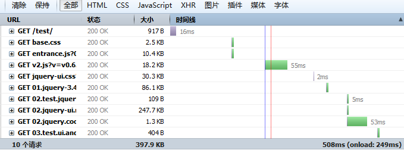
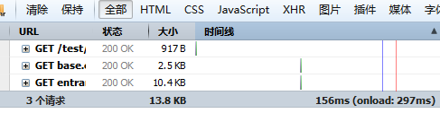
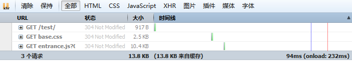
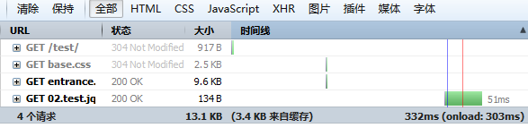

## 版本

smartload v1.0

## Demo
[demo地址](https://amhoho.github.io/smartload/demo/)

国内用户初次打开时因github原因可能较慢，但也正方便了二次和清空缓存后的测试。

## 作用

带有`重试`和`后备`模式(1个js可多个地址,1cdn地址下载失败后,重试2cdn地址,3地址)的把`css,js`等存入`localStorage`中。

支持全量或增量更新,只要`ls`未被清空(如二次打开页面或清空浏览器缓存)时,则从`localStorage`中读取,省却请求,节省带宽,又提高响应速度.

## 极简

仅需搞懂配置，即可上手。

## 概念

**配置**: 一个css/js/img等url域名和路径信息的json,即`entrance.js`的`smartloadConfig`,写到`entrance.js`有益合理利用304。

**入口文件**: 即`entrance.js`,页面唯一需要引入的`<script src=''>`文件。

**统一加载**: 页面初始化时,从配置中,按`key`加载。

**独立加载**: 页面初始化时,不从配置中加载,而按需引入。

## 配置基本写法:文件加载

```
整体格式:
[名称][格式.版本号][回调名称]主路径或url,后备1路径或url,后备2路径或url...

详细说明:
[名称] //如jquery,仅限"英文","数字",".","_","-"(必填)
[格式.版本号] 如//如js.v1.0或css.v1.0,当如v1.0修改v1.1后则更新该jquery缓存(可选,建议填)
[回调名称] //如callback,该jquery加载完成后想运行"function callback(){}",仅限"英文","数字",".","_","-"(可选)
主路径或url,后备1路径或url,后备2路径或url... //以此类推,路径时无需后缀,test/jq.js可写成test/jq(必填)
```

**统一配置示例**:
```
'jquery': '[js.v3.01][callback]test/jq,http://apps.bdimg.com/libs/jqueryui/1.9.2/jquery-ui.min.js',
'jquery': '[js.v3.01]test/jq,http://apps.bdimg.com/libs/jqueryui/1.9.2/jquery-ui.min.js',
'jquery': '[js]test/jq',
'jquery': '[js]http://apps.bdimg.com/libs/jqueryui/1.9.2/jquery-ui.min.js'
```

**独立配置示例**:
```
'[jquery][js.v3.01][callback]test/jq,http://apps.bdimg.com/libs/jqueryui/1.9.2/jquery-ui.min.js',
'[jquery][js.v3.01]test/jq,http://apps.bdimg.com/libs/jqueryui/1.9.2/jquery-ui.min.js',
'[jquery][js]test/jq',
'[jquery][js]http://apps.bdimg.com/libs/jqueryui/1.9.2/jquery-ui.min.js'
```

`注意:统一配置和独立配置可以混合使用`

`明白了以上写法之后,下方内容就很容易理解了`


## 配置基本写法:加载顺序

`_preload:true`:全部异步加载

`_preload:false`:按list键顺序加载

`_preload:[]`按数组的自定义顺序加载

顺序数组写法示例:
```
['a','b','c']//即a加载后才加载b,再下载c.
['a',['b','c']]//先加载a,再并行加载b和c.
[a,['b,c'],'d']//可混合以上
['jquery',['jquery.form','jquery.cookie'],'myformcode','mycookiecode']//示范
```

## 配置写法

```
var smartloadConfig={
entrance: {//入口地址:
file:'[js.v0.6.1]smartload/{$}',//命令行,{$}会被自动替换为自适应版本.
debug:'true'//是否打开调试,默认false;
},
config:{//配置信息:更新时将清理客户端缓存,进行全量更新.
name:'yourname',//必填,自定义的本地缓存库名称,
version:'v1.2',//必填,改动则全量更新
domain:{//域名,必填,格式如下,domain.css和domain.js必填.其余任意
//例如加了'test:'http://abc.com'之后.如被缓存的文件中存在`_domain.test_`则会被替换.
css:'http://127.0.0.1/test',//或http://www.test.com/css等
js:'http://127.0.0.1/test',//如果文件中存在_domain.css_,_domain.js_,_domain.img_将被替换为该值
img:'http://code.jquery.com/ui/1.10.4/themes/smoothness'
}
},
list:{//命令包,选填:格式如下,_preload是系统内置值
_preload:['jquery',['test_jquery','jquery_ui','jquery_ui_css','jquery_cookie'],'test_ui_and_cookie'],
//命令行
test_jquery: '[js.v0.1.1]test/02.test.jquery',
jquery: '[js.v3.4.1]test/01.jquery-3.4.1.min',//如果项目不考虑ie浏览器,请忽略该项
jquery_ui: '[js.v1.12.1]test/02.jquery-ui.min',
jquery_ui_css: '[css.v1.0.1]test/jquery-ui',
jquery_cookie: '[js.1.4.1]test/02.jquery.cookie',
test_ui_and_cookie: '[js.v1.0.01]test/03.test.ui.and.cookie'
}
};
```

## 如何全部更新或局部更新某个js或css

Q:全量更新？

A:修改config.version.

Q:增量更新？

A:修改响应命令行的version，例如`js.v0.1.1`改成`js.v0.1.2`即可增量更新

## 使用范例

```html
<html>
<head>
<link type="text/css" rel="stylesheet" href="base.css"/>
<!--base.css作用:通过该文件解决因css无任何加载前的页面闪动-->
<script type='text/javascript' src='entrance.js'></script>
</head>
<body>
</body>
</html>
```

## 兼容说明

`smartload` 以 `localStorage` , `async` 为界限,将全平台所有浏览器分成了三大类进行按类加载:

`v1.js`:不支持缓存的古老浏览器如:`ie8-`。

`v2.js`:支持缓存但不支持`async`如:`ie8+`,`firefox v52-`,`chrome v55-`等。

`v3.js`:支持缓存且支持`async·如:`firefox v52+`,`chrome v55+`。

版本号是向下兼容的,即 `v2.js`适用于 `v3.js`支持的浏览器。

 `v1.js` 过于古老,使用者不多,仅用 `alert`提示成功。
 
 `v3.js`尚无时间计划,直接以 `v2.js`替代了,从理论上而言 `v3.js` 将比 `v2.js` 快大约 `4-6` 倍。

## 测试效果:
1.未使用插件前打开页面



1.使用插件后首次打开页面(仅请求基本的，其余js均通过xhr请求)或清空浏览器缓存后首次打开(仅请求基本的，其余从ls读取了)


2.二次打开页面(基本的为304,其余的从ls读取了，除非人为故意删除否则极少会删除`ls`的情形，即缓存永久存储在浏览器中)


3.增量更新某个js



## 未来计划

1.支持图片,音视频缓存.

2.支持合并存取.

## 授权许可

采用MIT许可协议，在保留开发版权说明的情况下运行个人使用或商用。

@amhoho